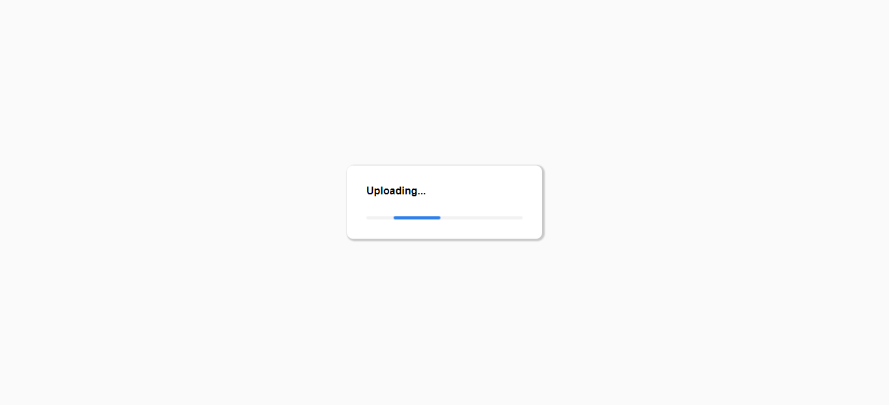

# Image Uploader

Frontend send file to server and it is stored in server folder.

## Run frontend

```sh
cd image-uploader
npm run dev | yarn dev
```

Open in <http://localhost:3000>

## Run server

```sh
cd server
npm run start | yarn start
```

Server is listen in <http://localhost:3500>

## Preview




